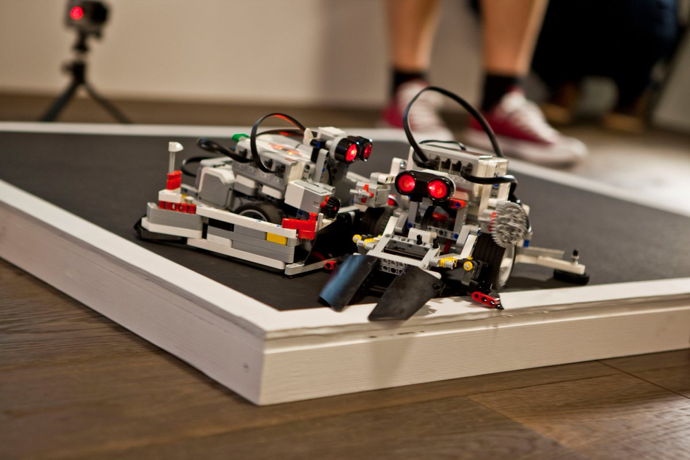
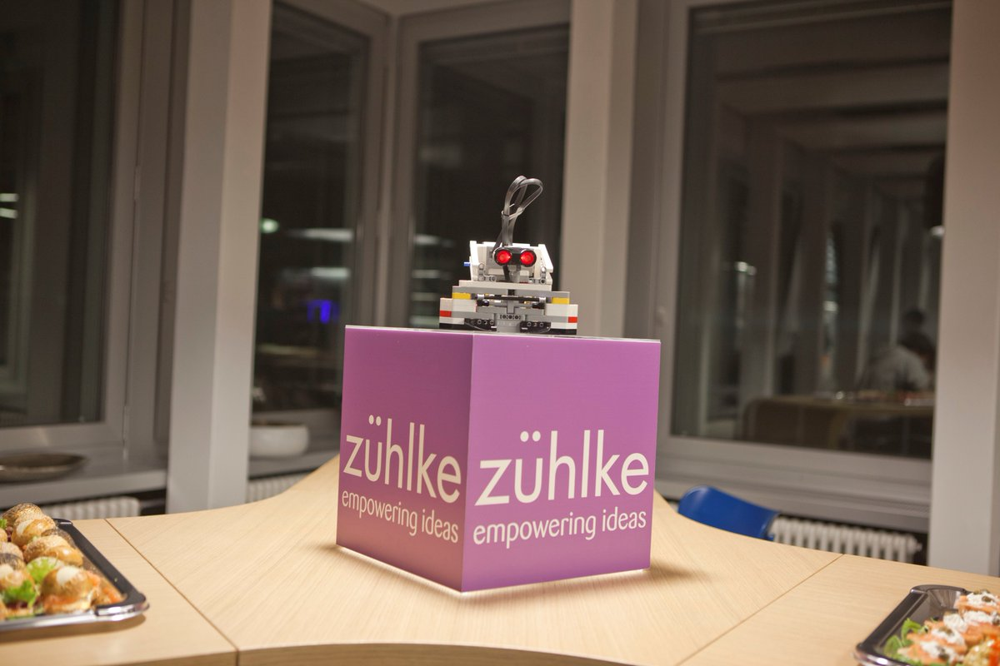
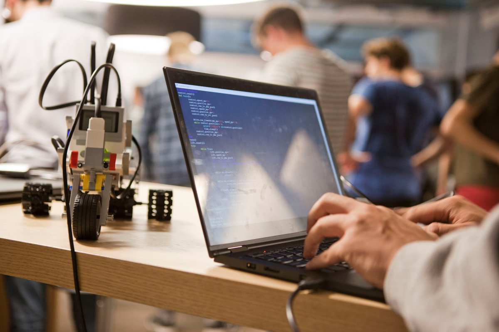
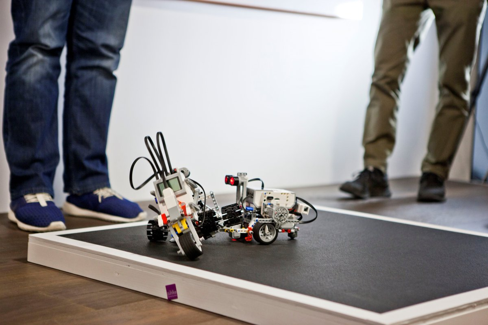

# Zühlke RoboChallenge
This is the official repository for the Zühlke RoboChallenge. 

__Upcoming events:__
- tbd

__Past events:__
- 4/5. Nov 2016, Bern (Switzerland), Sumo Challenge

|         |            | 
| ------------- |:-------------:| 
|       |  |
|       |  |

## The Challenges

You find detailed information regarding the challenges [here](challenges/sumo.md).

## Quickstart

To get started using Lego Mindstorms and ev3dev (http://www.ev3dev.org), please read the
[Quickstart](quickstart.md) tutorial.

## Frameworks
You can find example code for the different frameworks and programming languages 
in the [Framework](framework) section.

## Supported ev3dev Release
The latest examples supports the __ev3dev-jessie-2016-10-17__ release. For older examples have a look at the ['tag / release'](https://github.com/Zuehlke/robo-challenge/releases) section. 